<p align="center">
    <a href="https://git.io/typing-svg"></a>
    <a href="https://git.io/typing-svg"></a>
</p>

<p align="center">
	<a target="_blank" href="mailto:anwar.ezzirani69@gmail.com"></a>
	&emsp;
	<a target="_blank" href="https://www.linkedin.com/in/anwar-ezzirani/"></a>
	&emsp;
	<a target="_blank" href="https://x.com/AEzzirani"></a>
	&emsp;
	<a target="_blank" href="https://www.instagram.com/anwar_ezzi"></a>
	&emsp;
	<a target="_blank" href="https://discord.gg/4WFDTpHDtw"></a>
</p>

<picture>
  <source media="(prefers-color-scheme: dark)" srcset="https://github.com/AnwarEzzy/AnwarEzzy/blob/output/github-snake-dark.svg" />
  <source media="(prefers-color-scheme: light)" srcset="https://github.com/AnwarEzzy/AnwarEzzy/blob/output/github-snake.svg" />
  
</picture>

---

## 👨🏻‍🎓 About
<p align="left">
A mind fueled by innovation, a curiosity that never stops, and a passion for building intelligent solutions from data.
<br>
Turning complex problems into AI-driven insights — one model, one solution at a time.
<br>

```python
class AnwarEzzirani:

    def __init__(self):
        # who am I ?
        self.full_name = 'Anwar Ezzirani'
        self.username = '@AnwarEzzy'
        self.role = 'AI Engineering Intern @ Orange Maroc'
		self.education = "Computer Engineering Student @ EMSI"

        # find me
        self.linkedin = 'linkedin.com/in/anwar-ezzirani/'
        self.twitter = '@AEzzirani'
        self.email = 'anwar.ezzirani69@gmail.com'

        self.areas = ['Machine Learning', 'LLMs', 'RAG', 'AI Agents', 'Full-Stack Development']

    def __str__(self):
        return self.full_name


if __name__ == '__main__':
    me = AnwarEzzirani()
```

## 📊 Profile stat
<br />
<div align="center">
    
</div>

<p>
    
</p>
